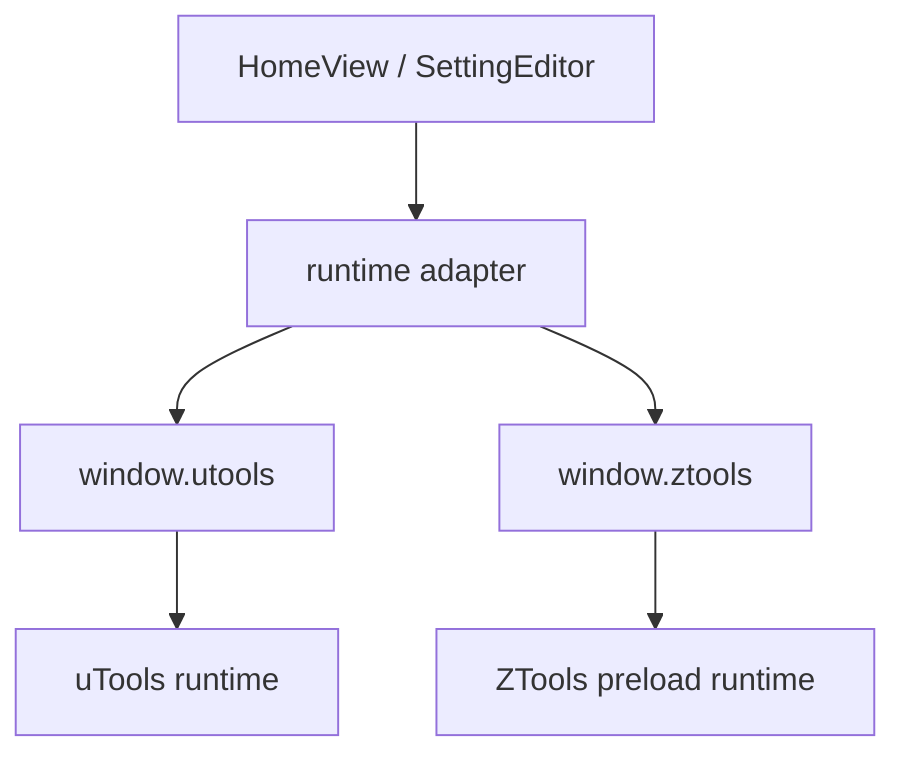

# 变更提案: ztools-compat

## 元信息
```yaml
类型: 新功能/重构
方案类型: implementation
优先级: P1
状态: 已确认
创建: 2026-05-06
```

---

## 1. 需求

### 背景
当前项目是面向 uTools 的 Vue 2 插件，运行时能力强依赖 `window.utools`、`public/plugin.json` 和 `public/preload.js`。用户希望在不放弃现有 uTools 支持的前提下，补充对 ZTools 的兼容，使同一套源码能够在两个平台中运行，并尽量保留文本翻译、截图 OCR 翻译、复制/输入、设置持久化等核心能力。

### 目标
- 让当前插件可以在 ZTools 中被识别、安装和正常打开。
- 保持对 uTools 的兼容，不引入只支持 ZTools 的破坏性改动。
- 为运行时 API 建立统一兼容层，避免业务代码继续散落平台判断。
- 保留现有核心功能：文本翻译、设置保存、截图翻译、复制、复制并隐藏、复制并输入。

### 约束条件
```yaml
时间约束: 本轮在现有项目内完成兼容改造，不迁移框架
性能约束: 不新增明显的启动时阻塞和大型依赖
兼容性约束:
  - 保持 uTools 可运行
  - 兼容 ZTools 的 window.ztools API 与 plugin.json schema
业务约束:
  - 截图/OCR 逻辑继续沿用当前 Google Vision/Translate 链路
  - 尽量避免改写核心翻译业务逻辑
```

### 验收标准
- [ ] `plugin.json` 兼容 ZTools 插件声明要求，并保留现有 uTools 可用字段
- [ ] 插件在运行时代码中不再直接依赖 `window.utools` 作为唯一平台入口
- [ ] 文本翻译、设置保存、复制、复制并输入、截图翻译在代码层有明确的双平台调用路径
- [ ] `npm run lint` 通过
- [ ] 知识库同步更新本次兼容方案涉及的运行时与模块文档

---

## 2. 方案

### 技术方案
采用“统一运行时适配层 + preload 兼容桥接 + 清单补齐”的方案：

1. 新增运行时桥接模块，统一暴露存储、通知、复制、隐藏并输入、截图、外链打开、插件进入事件等能力。
2. 在 `public/preload.js` 中检测 `window.ztools` / `window.utools`，对业务层继续使用的旧接口进行兼容别名封装。
3. 把视图层中仍然直接读取 `window.utools.dbStorage` 等调用收口到桥接方法，避免平台 API 再次散落。
4. 更新 `public/plugin.json`，加入 ZTools 识别所需字段（如 `$schema`、`title`、`description`、`author` 等），同时保留当前 uTools 与开发模式配置。
5. 新增类型声明文件，描述双平台运行时，降低后续维护成本。

### 影响范围
```yaml
涉及模块:
  - utools-runtime: 从单平台桥接升级为双平台运行时兼容层
  - translation-workbench: 改为通过统一桥接能力读取截图翻译缓存与插件进入事件
  - settings-editor: 继续复用现有配置写入逻辑，但底层调用切换为兼容层
  - app-bootstrap: 补充运行时全局类型接入
预计变更文件: 6-8
```

### 风险评估
| 风险 | 等级 | 应对 |
|------|------|------|
| ZTools 与 uTools 的 API 虽高度相似，但调用语义存在细微差异 | 中 | 以 ZTools 源码中的 `resources/preload.js` 为准，对照真实接口名实现桥接 |
| `plugin.json` 字段增加后可能影响 uTools 的读取行为 | 中 | 仅追加通用元信息字段，保留原有 `main/preload/features/development` 结构 |
| 视图层仍保留少量直接平台调用会造成漏兼容 | 中 | 用全文检索清理 `window.utools` 使用点，验收时再次扫描 |
| 截图回调在 ZTools 中签名与 uTools 略有差异 | 低 | 按 ZTools 源码确认首参仍为 base64 图像，兼容第二参 bounds |

### 方案取舍
```yaml
唯一方案理由: 当前两个平台的 API 能力高度接近，最优路径是建立统一兼容层并最小化业务改动，既能快速落地，又为后续维护保留清晰边界
放弃的替代路径:
  - 全面改写业务层为只使用 window.ztools: 会破坏现有 uTools 兼容，并扩大改动面
  - 保持现状只在 preload 中做粗暴全局别名: 能跑但维护性差，后续仍难以定位平台差异
  - 拆成两套独立插件产物: 交付复杂度和维护成本都明显更高，不符合“同一套代码兼容”目标
回滚边界:
  - 新增的 runtime 适配文件可独立移除
  - plugin.json 的 ZTools 元信息字段可单独回退
  - 视图层对桥接方法的替换可按文件逐步回滚
```

---

## 3. 技术设计

### 架构设计


### 数据模型
| 字段 | 类型 | 说明 |
|------|------|------|
| `platform` | `utools | ztools | unknown` | 当前运行时平台 |
| `pluginEnterPayload` | `object` | 插件进入时的统一负载 `{ code, type, payload, option? }` |
| `runtimeStorage` | `object` | 统一封装后的键值存储接口 |

---

## 4. 核心场景

### 场景: 双平台插件启动
**模块**: `utools-runtime`  
**条件**: 插件在 uTools 或 ZTools 中启动。  
**行为**: 运行时桥接层识别当前平台，并为页面提供统一的能力入口。  
**结果**: 业务层无需关心平台差异即可完成基础启动。

### 场景: 截图翻译
**模块**: `translation-workbench`  
**条件**: 用户在任一平台点击截图翻译按钮。  
**行为**: 通过统一截图接口获取 base64 图片，继续执行现有 OCR 与翻译流程。  
**结果**: 译文照常显示并缓存到统一存储。

### 场景: 复制并输入
**模块**: `utools-runtime`  
**条件**: 用户点击“复制并输入”或“模拟键盘输出”。  
**行为**: 桥接层转发到当前平台的隐藏主窗口并键入字符串能力。  
**结果**: 在两个平台下都能复用相同行为。

---

## 5. 技术决策

### ztools-compat#D001: 采用统一运行时适配层，而不是分叉两套业务实现
**日期**: 2026-05-06  
**状态**: ✅采纳  
**背景**: 项目目前直接依赖 `window.utools`，若逐处兼容 ZTools，改动会分散且难维护。  
**选项分析**:
| 选项 | 优点 | 缺点 |
|------|------|------|
| A: 统一运行时适配层 | 改动集中、双平台边界清晰、后续扩展成本低 | 需要先梳理全部运行时调用点 |
| B: 每个业务文件内分别判断 uTools / ZTools | 落地快、单点可改 | 代码分散、容易漏改、长期维护差 |
**决策**: 选择方案 A  
**理由**: 当前平台差异主要集中在 runtime API，而非翻译业务本身，用一层适配能最大化复用现有代码。  
**影响**: `public/preload.js`、视图层调用点、类型声明、插件清单。

### ztools-compat#D002: 保留现有 plugin.json，并追加 ZTools 需要的元信息字段
**日期**: 2026-05-06  
**状态**: ✅采纳  
**背景**: ZTools 使用带 schema 的 `plugin.json`，而当前项目只有 uTools 需要的最小字段。  
**选项分析**:
| 选项 | 优点 | 缺点 |
|------|------|------|
| A: 在现有 plugin.json 上增量补齐字段 | 单文件维护，兼容现有开发流程 | 需要控制字段兼容性 |
| B: 为不同平台维护两份清单 | 平台边界显式 | 打包和维护复杂度更高 |
**决策**: 选择方案 A  
**理由**: 两个平台的基础字段重合度高，增量补齐更符合本项目规模。  
**影响**: `public/plugin.json`

---

## 6. 验证策略

```yaml
verifyMode: review-first
reviewerFocus:
  - public/preload.js 的平台判定与兼容别名是否完整
  - src/views/HomeView.vue 是否已移除直接依赖 window.utools 的读取点
  - plugin.json 新增字段是否不破坏现有结构
testerFocus:
  - npm run lint
  - 检查文本翻译、设置保存、截图翻译、复制并输入的调用链是否都走统一桥接
uiValidation: none
riskBoundary:
  - 不在本轮迁移 Vue 2 / Vue CLI 架构
  - 不引入新的后端服务或凭据管理方案
  - 不删除现有 uTools 能力，仅在不支持时做显式降级
```

---

## 7. 成果设计

N/A。本次为运行时兼容和插件工程结构改造，不涉及视觉方向调整。
